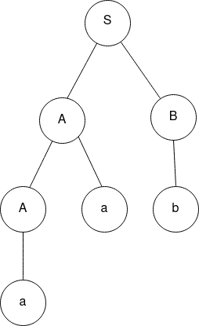

### Link your theory in here
# Ambiguity in CFG’s

## Pretest

1. What is a parse tree in the context of context-free grammars?

A. A tree structure representing the syntactic structure of a string
B. A tree used in searching algorithms
C. A tree representing the hierarchy of file directories
D. A tree data structure for sorting elements

******************Answer: A******************

1. In the context of CFGs, what does a production rule represent?

A. A terminal symbol in the language
B. A non-terminal symbol in the language
C. A mapping from a set of symbols to another set of symbols
D. A rule for lexical analysis in compilers

****************Answer: C****************

1. What is ambiguity in the context of context-free grammars?

A. The ability of a grammar to represent multiple languages
B. The presence of more than one parse tree for a given string
C. The complexity of a grammar's production rules
D. The flexibility of a grammar to adapt to different contexts

******************Answer: B******************

## Introduction

CFGs can be ambiguous - which implies that multiple parse trees can be generated from the same input. For a string generated from ambiguous grammars, there exist multiple left-most or right-most derivations. 

**************************************Left Most Derivation:************************************** 

Left-most derivation of a string is dine by replacing the left-most **************************non-terminal************************** symbol according to the corresponding production rule.

********************************************Right Most Derivation:********************************************

The right-most derivation of a string is dine by replacing the right-most **************************non-terminal************************** symbol according to the corresponding production rule

## Ambiguity in Context Free Grammar

A context free grammar G is called an ambiguous grammar if it has more than one derivation tree for a given string **w ∈ L(G).** There are no algorithms to check whether a given grammar is ambiguous or not. We can check if the given grammar is ambiguous or not by constructing parse trees for a given input string and check the number of parse trees that can be obtained for the given input. It should be noted that there can be a few strings produced by an unambiguous grammar that can have only one parsed tree. 

### Examples

1. Consider the following grammar and construct the parse tree for the string $aab$

$$
S → AB \\ A → Aa | a \\ B → b
$$

For the string $aab$, there is only one parse tree possible, as shown below-

1. Check if the context-free grammar G is ambiguous
    
    $$
    G = \{ S → SS, S → ab, S → ba, S → ? \}
    $$
    
    Let us consider a string $abab$. There are more than one left-most derivations for this string as given below-
    
    $$
    S → SS → SSS → abSS → ababS → abab \\ 
    S → SS → abS → abab
    $$
    

Hence, the grammar is ambiguous.

## Removal of Ambiguity

Ambiguity in CFGs can be removed by modifying the grammar as to ensure that each string has a unique parse tree. Ambiguity can be removed on the basis of the following properties-

**Precedence and Associativity-** 

Precedence determines the order of operations in an expression, where as associativity determines the grouping direction for operations in the same. 

**********************Left Factoring-**********************

Combining common prefixes into a single production rule can eliminate ambiguity. 

## Questions and Answers

1. What is left-most derivation in a context-free grammar?
    
    A: Derivation where the left-most non-terminal is replaced at each step.
    
2. What is ambiguity in CFGs?
    
    A: A grammar is considered ambiguous when the CFG generates a string with more than one parse tree.
    
3. Why is it important to remove/resolve ambiguity in CFGs?
    
    A: Removing ambiguity ensures unique interpretation and avoids confusion and errors in parsing.
    
4. What is the importance of precedence and associativity? 
    
    A: Precedence ans associativity define the order and grouping rules for expressions, which can be used to resolve ambiguity. 
    
5. How does left-factoring help in resolving ambiguity?
    
    A: Left factoring combines common prefixes in the production rules, which can further eliminate ambiguity. 
    

## Practical Applications

A few practical examples highlighting the importance of resolving ambiguities in CFGs - 

1. **Compiler Design:**
    
    Ambiguous grammars can cause confusion in compilation due to potentially forming multiple parse trees from the same source code. Removal of ambiguities ensure unique interpretation.
    
2. **Programming Languages:**
    
    Removing ambiguities will ensure that each statement/expression in the language has a unique and well-defined meaning. 
    
3. **********************************************Expression Evaluation:**********************************************
    
    Ambiguities in precedence can lead to different interpretations of arithmetic expressions. By specifying proper precedence and associativity rules, consistent evaluation of expressions can be ensured.
    

## Posttest

1.  **Which of the following is a consequence of ambiguity in CFGs?**
A. Efficient parsing
B. Deterministic parsing
C. Ambiguous parse trees
D. Unambiguous grammars

**Answer: C**

1. What is the key difference between a leftmost derivation and a rightmost derivation in context-free grammars?

A. The direction in which non-terminals are expanded
B. The number of production rules used
C. The presence of epsilon (ε) productions
D. The length of the input string

******************Answer: A******************

1. **How can ambiguity be resolved in a CFG?**
A. By making the grammar more complex
B. By introducing more non-terminals
C. By adding more production rules
D. By rewriting the grammar to make it unambiguous

**Answer: D**

## References

1. Introduction To The Theory Of Computation, Micheal Sipser
