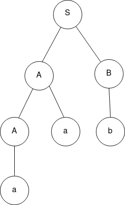

## Introduction

CFGs can be ambiguous - which implies that multiple parse trees can be generated from the same input. For a string generated from ambiguous grammars, there exist multiple left-most or right-most derivations. 

**Left Most Derivation:** 

Left-most derivation of a string is dine by replacing the left-most **non-terminal** symbol according to the corresponding production rule.

**Right Most Derivation:**

The right-most derivation of a string is dine by replacing the right-most **non-terminal** symbol according to the corresponding production rule

### Ambiguity in Context Free Grammar

A context free grammar G is called an ambiguous grammar if it has more than one derivation tree for a given string **w ∈ L(G).** There are no algorithms to check whether a given grammar is ambiguous or not. We can check if the given grammar is ambiguous or not by constructing parse trees for a given input string and check the number of parse trees that can be obtained for the given input. It should be noted that there can be a few strings produced by an unambiguous grammar that can have only one parsed tree.

#### Examples

1. Consider the following grammar and construct the parse tree for the string $aab$

$$
S → AB \\ A → Aa | a \\ B → b
$$

For the string $aab$, there is only one parse tree possible, as shown below-

1. Check if the context-free grammar G is ambiguous

$$
G = \{ S → SS, S → ab, S → ba, S → ? \}
$$

Let us consider the string $abab$. There are more than one left-most derivations for this string as given below-

$$
S → SS → SSS → abSS → ababS → abab \\ 
S → SS → abS → abab
$$    

Hence, the grammar is ambiguous.

### Questions and Answers

1. What is left-most derivation in a context-free grammar?
    
    A: Derivation where the left-most non-terminal is replaced at each step.
    
2. What is ambiguity in CFGs?
    
    A: A grammar is considered ambiguous when the CFG generates a string with more than one parse tree.
    
3. Why is it important to remove/resolve ambiguity in CFGs?
    
    A: Removing ambiguity ensures unique interpretation and avoids confusion and errors in parsing.
    
4. What is the importance of precedence and associativity? 
    
    A: Precedence ans associativity define the order and grouping rules for expressions, which can be used to resolve ambiguity. 
    
5. How does left-factoring help in resolving ambiguity?
    
    A: Left factoring combines common prefixes in the production rules, which can further eliminate ambiguity.

### Practical Applications

A few practical examples highlighting the importance of resolving ambiguities in CFGs - 

1. **Compiler Design:**
    
    Ambiguous grammars can cause confusion in compilation due to potentially forming multiple parse trees from the same source code. Removal of ambiguities ensure unique interpretation.
    
2. **Programming Languages:**
    
    Removing ambiguities will ensure that each statement/expression in the language has a unique and well-defined meaning. 
    
3. **Expression Evaluation:**
    
    Ambiguities in precedence can lead to different interpretations of arithmetic expressions. By specifying proper precedence and associativity rules, consistent evaluation of expressions can be ensured.